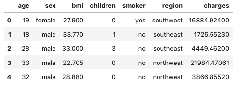
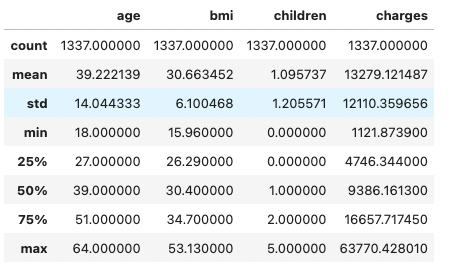
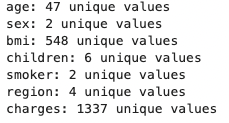
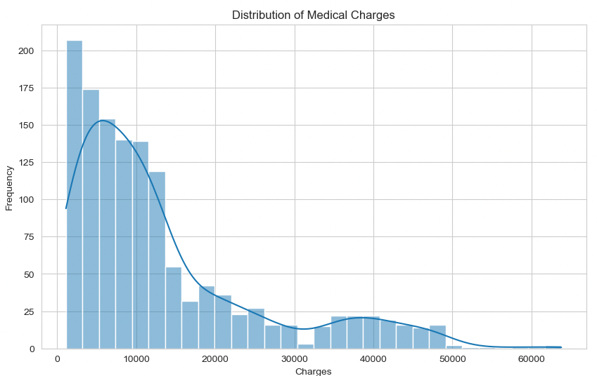
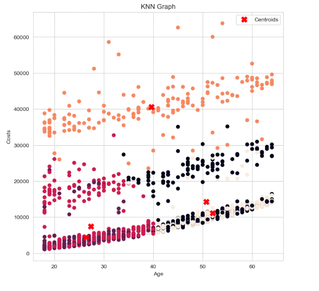
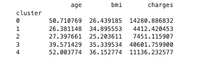
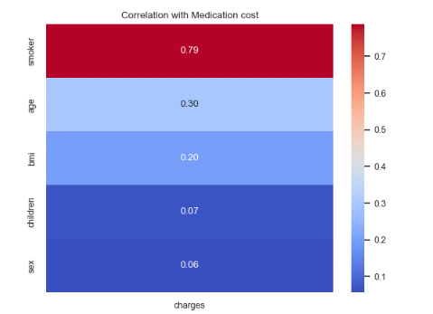

# medical cost analysis

## Introduction:
This dataset is provided by Brett Lantz and Packt Publishing.

## Data

age: age of primary beneficiary

sex: insurance contractor gender, female, male

bmi: Body mass index, providing an understanding of body, weights that are relatively high or low relative to height,
objective index of body weight (kg / m ^ 2) using the ratio of height to weight, ideally 18.5 to 24.9

children: Number of children covered by health insurance / Number of dependents

smoker: Smoking

region: the beneficiary's residential area in the US, northeast, southeast, southwest, northwest.

charges: Individual medical costs billed by health insurance

These features can be used and analyzed with appropriate statistical and machine learning techniques and can help in predicting an individual's medical costs.
## Exploratory Data Analysis

## Modeling

## Other Finidings

## Future Directions